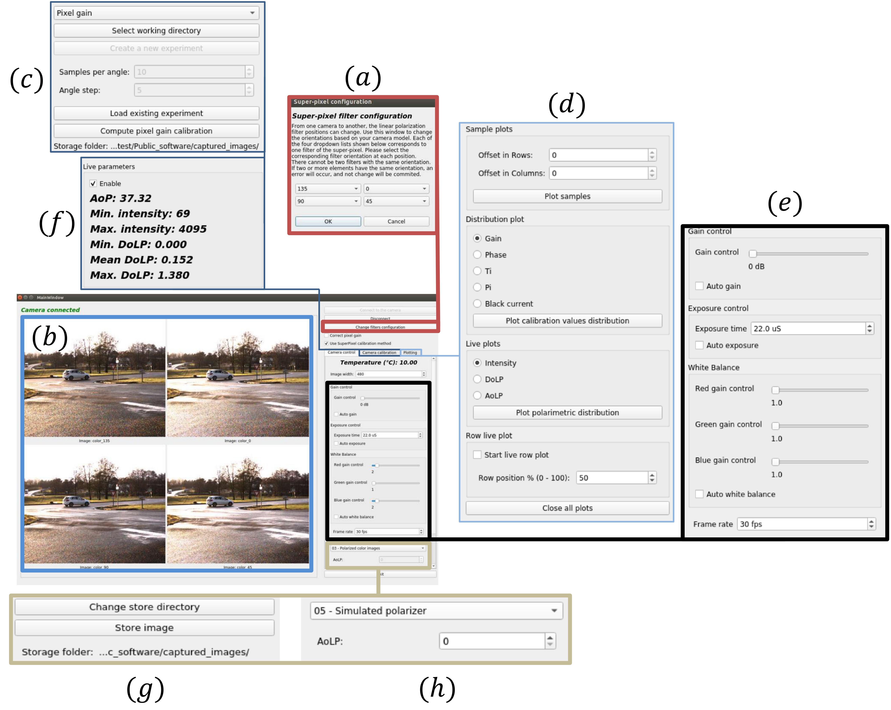

# Pola4All: a unified codebase for division-of-focal-plane polarization cameras
In this repository we include a complete toolkit with graphical user interface
to interact with division-of-focal-plane (DoFP) polarization cameras. This
project aims to be flexible with several manufacturers that make use of this
technology to measure polarization and color information. Particularly, there
are several brands that produce RGB-polarization cameras, that makes use of the
same sensor. Nonetheless, each manufacturer contains a set of functionalities
available for their cameras, that either do not consider polarization
processing, either the processing is too basic. In all the cases, they do not
allow adding applications to their softwares, and they are not thought to work
with robotics applications.

With this toolkit, we break these contraints by making a server-client architecture
that is aimed to work with any camera brand used (Lucid, Basler, Flir,
etc), and connection type (USB or Ethernet). The only remaining work for the
user is to develop the driver to connect to the camera (if it is not already
included). This driver is a C++ class file that performs the connection and
initialization of the camera, and the allows to do the most basic functionalities required
(triggering configuration, image retrieval, set / get acquisition parameters).

Once done that, the toolkit functionalties are available for the new camera.

To ease the start up, we have included two docker images (one when an NVIDIA
graphics card is available, and one when an Intel graphics card is available).
Using docker allows the software to run in the same environment, no matter the
host operating system. Nevertheless, we include an installation script in case
the user does not want to use docker. The installation instruction are given
below.

This project has been developed using ROS 1. We hope soon to have a ROS2 version
for the server module.



## Citation
If you find this code useful for your research, please cite the paper:
```TeX
@article{Pola4AllPaper,
  author = {Joaquin Rodriguez and Lew-Fock-Chong Lew-Yan-Voon and Renato Martins and Olivier Morel},
  title = {{Pola4All: survey of polarimetric applications and an open-source toolkit to analyze polarization}},
  volume = {33},
  journal = {Journal of Electronic Imaging},
  number = {1},
  publisher = {SPIE},
  pages = {010901},
  keywords = {polarization, computer vision, robotics, scene understanding, division-of-focal-plane, Polarization, RGB color model, Cameras, Tunable filters, Polarized light, Polarimetry, Image segmentation, Reflection, Pose estimation, Specular reflections},
  year = {2024},
  doi = {10.1117/1.JEI.33.1.010901},
  URL = {https://doi.org/10.1117/1.JEI.33.1.010901}
}
```

# Setup
This system aimed to work in Linux (for now).

The recommended way to use this software is through
[Docker](https://www.docker.com/). Docker is a contenarization method that
allows to work in an isolated workspace without touching your host operating
system. Since it is isolated, it allows to have another operating system
different from the host. This way, you can have any distribution of Linux
installed, and the container can run another distribution of Linux. Anything
that is installed inside the Docker image is not installed in your host system.
Thus, when the docker image is erased, no leftovers are kept in your machine.

If Docker do not want to be used, several dependencies need to be installed in
the local system. Below we explain both methods.

## Method 1: Docker installation
Follow the instructions in the folder [Docker](Docker)

## Method 2: Local installation
Ready-to-use script:
```bash
./install_local.sh
```

If you want to control what this script does, here you have the detailed instructions.
Note that this method is aimed to work only on Ubuntu 20 LTS

1. Open a terminal, and install the dependencies:
```bash
sudo apt-get update && \
    DEBIAN_FRONTEND=noninteractive sudo apt-get install -y --no-install-recommends \
      software-properties-common \
      apt-transport-https \
      wget \
      git \
      sudo \
      gdb \
      gcc \
      g++ \
      make \
      libglu1-mesa-dev \
      zsh \
      cmake \
      vim \
      net-tools \
      apt-utils \
      tar \
      language-pack-en \
      qt5-default \
      python3 \
      python3-pip \
      ipython3 \
      python3-tk \
      libopencv-dev \
      python3-opencv \
      python3-wstool \
      curl
```

2. Install [ROS Noetic](https://wiki.ros.org/noetic/Installation/Ubuntu):
```bash
sh -c 'echo "deb http://packages.ros.org/ros/ubuntu $(lsb_release -sc) main" > /etc/apt/sources.list.d/ros-latest.list'
curl -s https://raw.githubusercontent.com/ros/rosdistro/master/ros.asc | apt-key add -
sudo apt-get update && DEBIAN_FRONTEND=noninteractive apt-get install -y --no-install-recommends ros-noetic-desktop-full
```

3. Clone this repository (for instance, in your HOME directory)
```bash
git clone https://github.com/vibot-lab/Pola4all_2023.git ${HOME}/Pola4All
```

4. Install the SDK of the cameras you want to use (for the moment, only Basler
   Pylon SDK is required):
```bash
sudo apt-get update && dpkg -i ${HOME}/Pola4All/Docker/3rdparty/pylon6.deb
```

5. Install Python dependencies:
```bash
python3 -m pip install matplotlib numpy scipy pygame
```

# Using the software
This software is separated into two main blocks: a ROS server and a client. Each
of them has to be initialized separatedly. There is no initialization order. The
server will communicate directly with the camera, and the client will receive
the raw images from it. Additionally, the client can request camera parameters
as well as set them.

The server only manipulates raw images from the camera, and the client contains
all the processing algorithms. This way, this last component is independent of
the camera model we use.

Before starting, we need to inform our system about the ROS commands. This is
firstly done by sourcing the setup file. When this is the first time we run ROS,
we can do it by executing the following line at EACH TERMINAL in which we are
going to run the ROS commands:
```bash
source /opt/ros/noetic/setup.bash
```
NOTE 1: If we are using the terminal ZSH instead of BASH, we change the file
extension from bash to zsh.

NOTE 2: If we want to make this line permanent for each terminal we will open,
we have to add this line at the end of the file located at ~/.bashrc or ~/.zshrc
if we are using respectively, bash or zsh terminal.

Then, we need to have the server available, thus we need to compile it first,
and then run it. For doing so, we execute the following line:
```bash
${HOME}/Pola4All/build_project.sh -b
```
This command will compile both, the GUI and the ROS server. To run the program,
you have to do as follows:

1. Start a roscore:
```bash
roscore
```

2. Start the ROS server to connect to the camera (for the moment, only ***BaslerUSB***
   or ***TemplateDriver*** drivers are available):
```bash
source ${HOME}/Pola4All/RosCameraServer/devel/setup.bash
roslaunch polarimetric_camera_server start_camera_server_legacy.launch master_cameras_drivers:=\['TemplateDriver'\]
```

3. Run the GUI software by doing:
```bash
${HOME}/Pola4All/build_project.sh -b -r
```

If no error appeared, you should see the program interface. To start receiving
the images from the server, we need to click the button "Connect to the camera"
(top right button). To stop receiving them, we click the button "Disconnect".

There are three tabs in this user interface:
* Camera Control: It contains all the camera acquisition parameters that can be
  changed (e): frame rate, exposure time, and pixel gain. Additionally, we can store
  the shown image (g), and we can change the algorithm applied to the raw image (h).
  This last point will change the output images shown in the main window (b).

* Camera Calibration: It contains all the operations related to the polarimetric
   camera calibration explained in [this
   paper](https://ieeexplore.ieee.org/document/9834097) (c). It also shows a set
   of parameters of the currently show image (f) to know if the acquisition
   condition is correct.

* Plotting: It allows to plot a set of variables that help to understand the
  sensor quality, the calibration samples, and the image distributions before
  and after calibration (d).

## Server architecture
To be able to abstract the server from the camera used, we have created a common
interface module: IPolarizationCamera.hpp. This class contains all the
functionalities common to any DoFP camera. Then, each driver created should
inherits this class, and implement its methods, plus all the other ones required
to connect and initialize the camera, and then retrieve the raw images, and
change the acquisition pararameters.

Then, a topic has been created to send the raw images from the camera and the
sensor temperature, and all the other operations to get and set the camera
parameters are done through services. There is also a service used to test if
the camera is answering or not.

The server is aimed to work with one or more cameras. All the topic names are
the same, but to identify which one corresponds to a given camera, the camera
name is appended to all its topics. Thus, each camera should be assigned an
identifier that allows to talk to it uniquely. For Basler Cameras, this is done
through a name that the user can set through the Pylon GUI software. TO use our
GUI, only one camera is supported at the time, and its name should be an empty
string. Therefore, there is no appended string to the topic name.

Once the drivers created, and the names assigned, the server allows the
connection to several cameras by specifying their driver and camera name IDs.
The server expects the following arguments:

* ***bit_depth***: it is a number that tells how many bits are used to code the pixel
intensities. For the Basler cameras, this value can be either 8 bits either 12
bits. This variable should match with the arguments in the main.cpp file of the
GUI program. The usedFormat variable should be changed accordingly to the value
used in the server, and compiled before using it. If not, there will be
miscaling values when showing and processing the raw images.

* ***free_run_mode***: It means if the camera should be used in triggering mode (this
argument should be False), either in continuous mode (this argument should be
True).

* ***master_cameras_drivers***: It is a list with the identifiers of the cameras that
should act as master cameras. This is useful when using hardware
synchronisation, and there is a camera that generates the triggering signal for
the other cameras. To do not discard options, this list can contain more than
one element, and each element is a string with the driver name to use.

* ***master_cameras_names***: This is another list, whose element are the strings that
uniquely identify the camera to use. The order of this list should match with
the corresponding drivers given in master_cameras_drivers. This information is
required since we can have more than one camera with the same driver, thus we
need to identify them properly.

* ****publish_frequency****: This variable regulates the frame rate of the main loop
that publishes the images and the temperature. In general, we set this frequency
to the maximum value allows by the camera.

* ***slave_cameras_drivers***: Same as for master_cameras_drivers, but for the cameras
that wait to receive a hardware trigger signal to capture an image.

* ***slave_cameras_names***: Same as for master_cameras_names, but for the cameras
that wait to receive a hardware trigger signal to capture an image.

For convenience, we have created a few roslaunch files that enable working with:
one camera, or two cameras. In the last case, we also include a case for
asynchronous acquisition, and one for synchronous acquisition. These files can
be used as templates to create others specific to the developed application.

For example, if we want an arrangement with two Basler cameras, working
synchronously (one master one slave), with a bit depth of 12 bits, we can run
the command as follow:
```bash
roslaunch polarimetric_camera_server start_camera_server_stereo_sync.launch bit_depth:=12 master_cameras_drivers:=\['BaslerUSB'\] slave_cameras_drivers:=\['BaslerUSB'\] master_cameras_names:=\['Ace_POLA_RGB_01'\] slave_cameras_names:=\['Ace_POLA_RGB_02'\]
```
where 'Ace_POLA_RGB_01' and 'Ace_POLA_RGB_02' are the camera identifiers defined
by the user.

These parameters seem to be overwhelming, but if they do not change, they can be
set as default values in the roslaunch file, thus the command will be shorter.

## Client architecture
We followed as much as we could a modular architecture, i.e., all the
functionalities have been developed as a module independent from the others.
Each module is a folder, and they are separated by header and source files.

All the modules are instantiated, connected, and integrated into the MainWindow
file, resulting in a star shape architecture. This way of working has the
disadvantage that the MainWindow file grows fast in terms of amount of code.
Nonetheless, it eases the addition and supression of functionalities, without
affecting the others. It also enables an easy maintainance of the code.

All the modules have been well documented, trying to be as clear as possible.
Each custom widget is stored in a separated folder, and we tried to avoid doing
processing inside them. The core operations of the program are separated from them
to allow the re-usage of them without Qt.

Briefly, the code contains the following widgets:
* ImageWidget: It is in charge of showing the different images, output of the
  processing algorithms, as a grid of images.

* LoadSaveWidget: It is the graphical interface that helps the user to save and
  load calibration data in the software.

* MatPlotLibPlotsWidget: It contains all the functionalities to plot the sensor
  and calibration parameters and histograms. It makes use of the CPython library
  and MatPlotLib for Python. The base code to make the interface between Python
  and C++ has been taken from [this
  link](https://github.com/lava/matplotlib-cpp). Since the first version, we
  have added some functionalities not included in the module.

* ParametersWidget: It contains the camera acquisition parameters control panel
  in the first tab of the GUI.

* RealTimeParameters: It shows the image parameters included in the second tab.

* SaveImagesWidget: It comprise the widget in charge of storing the currently
  shown image in the GUI.

* VisualizationModeWidget: Widget that includes a drop-down list, and with it,
  we can change the image we show. This is done by selecting a different
  processing algorithm that is then communicated to the processing module.

Regarding the modules with non-graphical user interface, we have:
* SoftwareWhiteBalance: It is a simple implementation of a white balance
  algorithm. It enables manual set of the color gains, as well as an automatic
  white balance algorithm. This was necessary since the Basler cameras do not
  include this software in their polarization cameras.

* LoadSaveExperiments: Module that load and saves images for the calibration
   algorithm. It is in charge of creating a folder, storing the images in disk,
   do the average of a set of images, and keep them in internal variables while
   the software is running.

* PixelGainCalibration: Implementation of the calibration algorithm taken [from
  here](https://github.com/vibot-lab/PolaCalibration_RAL_2022).

* PolarimetricImagesProcessing: Module that implements all the processing
  algorithms available in the software. It receives a raw image from the camera,
  and it outputs a vector of processed images.

* RosCamClient: ROS client module. It connects to the topics, it receives the
  raw images from the camera, and it makes the interactions with the server to
  change or query the acquisition parameters.
  